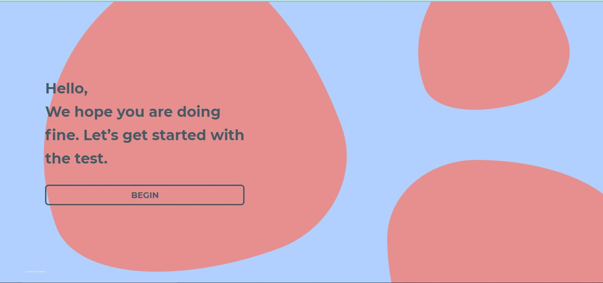
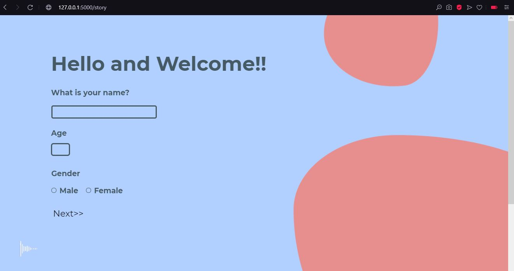
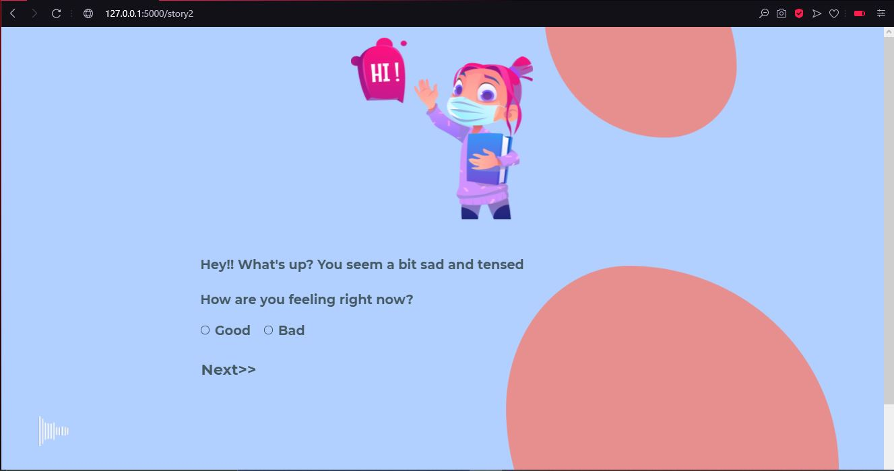
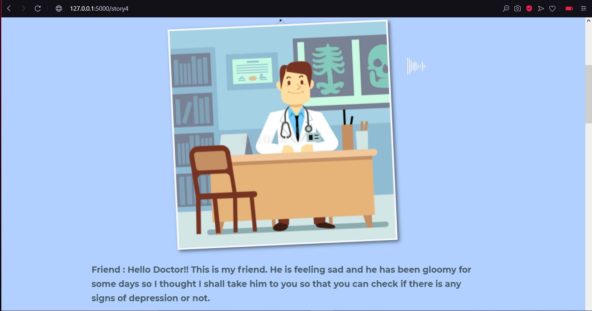
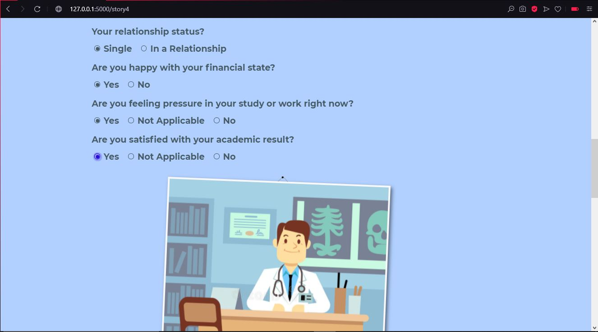
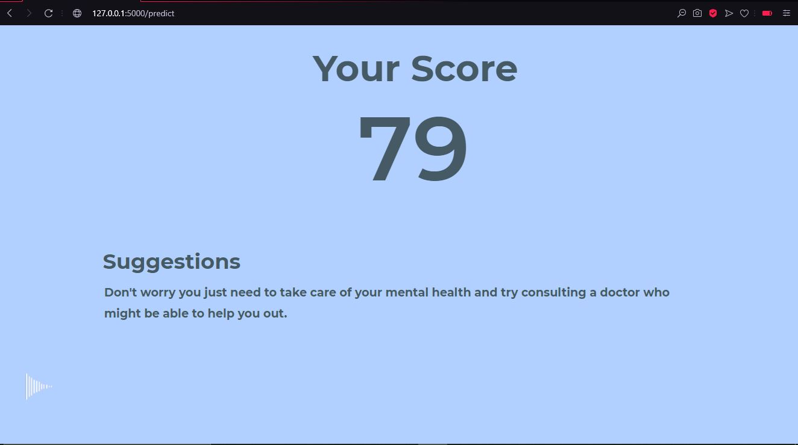

# Design-project-Depression-Detection

A Web App built to detect depression while using a story based survey approach and used deep learning model to detect depression.

Objectives: To develop a browser-based game. To create a deep learning model to detect depression.

The project is built on flask framework, so we have created the file directory in a way the flask server supports. The HTML files are in Templates folder and the CSS and Javascript files in Static folder. Please refer to flask documentation on how to setup a flask file directory.

### Prototyping in Figma

{% embed url="https://www.figma.com/proto/0dkVyly1NnfwzTGesvlUep/Depression-detection-website?node-id=2%3A0&page-id=0%3A1&scaling=scale-down-width&starting-point-node-id=2%3A0&viewport=270%2C48%2C0.07" %}
Prototyping in Figma


Steps to run this application-

1. Download the project and unzip it into any loaction you want.
2. Install Python if you haven't already and after installing it download flask and other dependencies on your computer (Working on deploying the application on cloud till then please follow the steps).
3. After installation open command promt and move to the location where you downloaded the project
4. Once you reach the exact path type "python views.py" to run the flask server
5. Once it runs you will get a link, copy it and open it in your browser
6. The project will be up and running

### Output (Web App Flask Framework)

     

Working on the deployment part where I will deploy the application on cloud using heroku.
